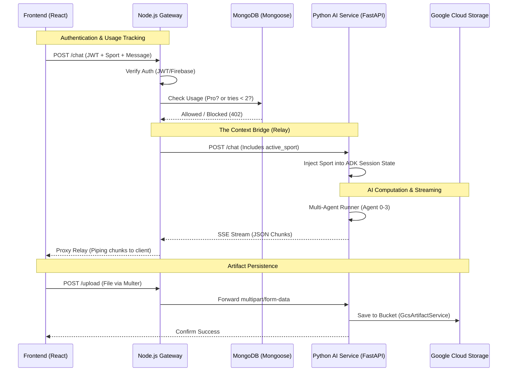

# Full Architecture: Sports AI Coaching System

This plan details the end-to-end integration between the Node.js secure gateway and the Python AI microservice. It covers authentication, subscription logic (2-try limit), and the "Context Bridge" for passing sports-specific metadata.

## System Architecture Diagram

## User Review Required

> [!IMPORTANT]
> - **Multer Config**: Node.js will use `multer` to handle files temporarily before relaying them to Python.
> - **Streaming Proxy**: The Node server will use `responseType: 'stream'` to ensure the user gets a "live typing" experience even though Node is in the middle.
> - **Error Handling**: 402 "Payment Required" will be sent if a trial user exceeds 2 messages.

## Implementation Steps

### Phase 1: Python "Context" Ready (COMPLETED)
- [x] Update `ChatRequest` to accept `active_sport`.
- [x] Update `chat_endpoint` to inject sport into `session_service`.

### Phase 2: Node.js Core Setup
- **[MODIFY] [index.js](file:///d:/Project/AI/Youtube_agent/Agent047/backend/index.js)**: Initialize Mongoose connection and global middleware.
- **[NEW] [User.js](file:///d:/Project/AI/Youtube_agent/Agent047/backend/models/User.js)**: Schema for tracking `usageCount` and `isPro`.

### Phase 3: Auth & Usage Middlewares
- **[NEW] [authMiddleware.js]**: Verify tokens from UI.
- **[NEW] [usageMiddleware.js]**: Enforce the 2-try limit using a combined "Find and Increment" atomic operation.

### Phase 4: Streaming & Relays
- **[NEW] [aiController.js]**: 
    - Implement the **Streaming Relay** for `/chat` (piping the response).
    - Implement **Multer Relay** for `/stats_upload` (forwarding files to Python).

## Verification Plan

### Automated Tests
- Script to hit Node.js `/chat` 3 times:
    - 1st & 2nd: Expect 200 OK + Stream.
    - 3rd: Expect 402 Payment Required.
- Script to send `{ sport: "Rugby" }` and verify AI response discusses scrums or speed drills.

### Manual Verification
- Testing file upload through Node.js and checking if the file appears in the GCS bucket.
